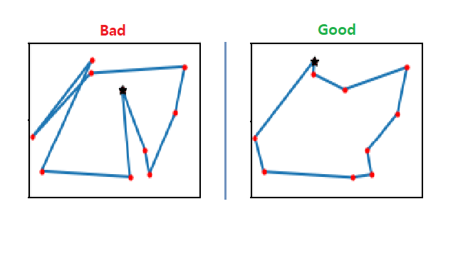
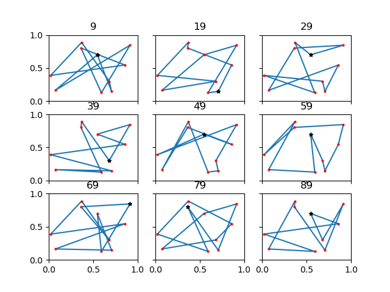
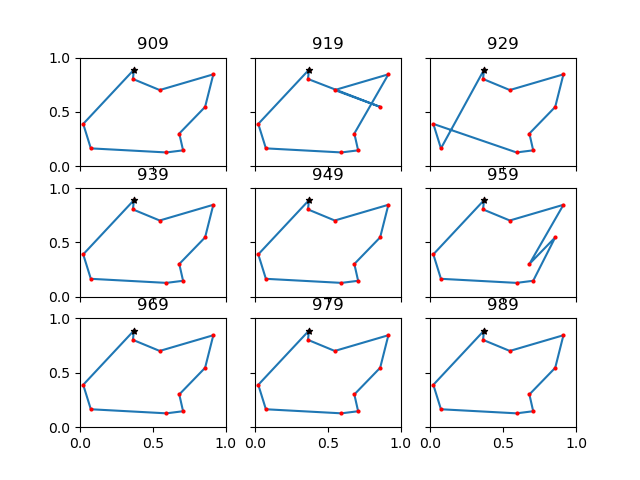
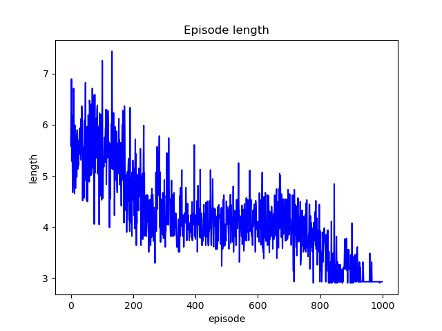
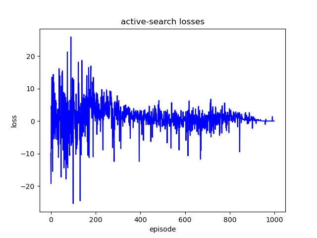
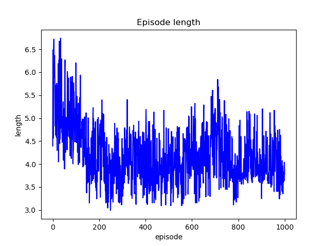
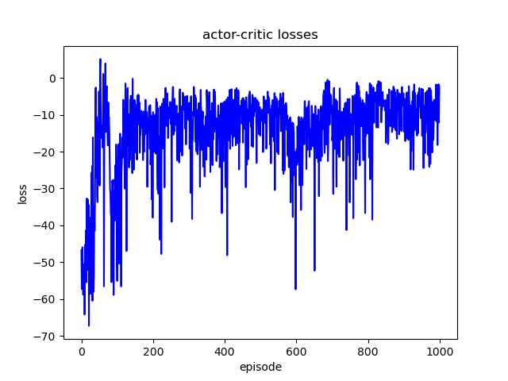

# TSP Solver

Neural Combinatorial Optimization with RL

Pytorch implementation of
[Neural Combinatorial Optimization with Reinforcement Learning](http://arxiv.org/abs/1611.09940)  

The model is trained by Policy Gradient.  

## What is Traveling Salesman Problem(TSP)
Given a list of cities and the distances between each pair of cities, what is the shortest possible route that visits each city exactly once and returns to the origin city?  
[Wikipedia](https://en.wikipedia.org/wiki/Travelling_salesman_problem)  

   


## Prerequisites
- pytorch
- matplotlib
- [or-gym](https://github.com/hubbs5/or-gym)
```
pip install or-gym
```

This repository is tested ...

- Windows 10
- Python 3.6
- Pytorch 1.7.1


## Reward
We did not use the reward function in the paper.  
We used the sum of rewards from the gym. but gym doesn't go back to the starting point.  
After the game, the distance from the last point and the starting point is added to the total reward.  

## Usage
### Active search
```
python tsp_trainer.py --mode active-search
```
### Actor critic
```
python tsp_trainer.py --mode actor-critic
```
#### [configs](config.py)
```
--lr 3e-4
--embedding_size 128
--hidden_size 128
--grad_clip 1.5
--decay 0.01

--n_glimpses 2
--tanh_exploration 10
--beta 0.99
--episode 1000
--seq_len10

--mode active-search
--result_dir ./result
```
## Results

### Active search
   
   

### Actor critic
    


## Prior knowledge
- RL (Actor-critic)
- [Pointer Network](https://arxiv.org/abs/1506.03134)

